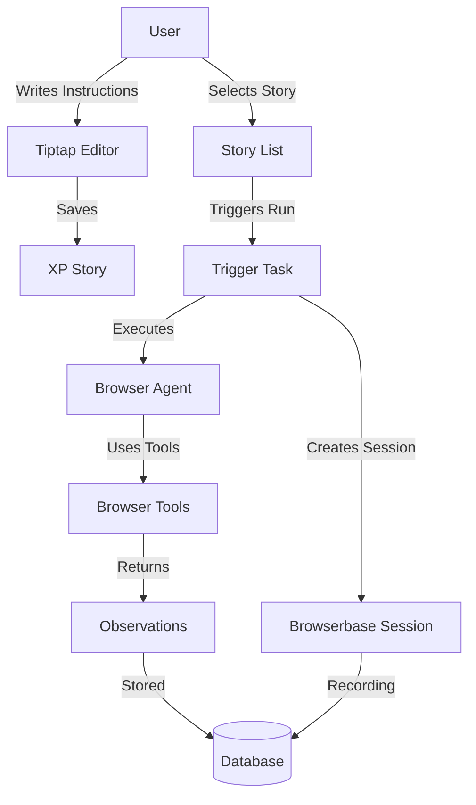

# Browser Agents Experimental Feature

## Overview

This plan implements an experimental feature for browser agents that allows users to write instructions for AI agents to perform browser-based actions. This is a standalone experimental feature with its own tables, not tied to existing stories.

## Architecture



## Database Schema

Create two new tables with `xp_` prefix in `packages/db/src/schema.ts`:

### `xp_stories` - Stores experimental browser agent stories

| Column         | Type      | Description                       |
| -------------- | --------- | --------------------------------- |
| `id`           | uuid      | Primary key                       |
| `user_id`      | text      | Foreign key to user               |
| `name`         | text      | User-friendly name                |
| `instructions` | text      | Markdown instructions from Tiptap |
| `created_at`   | timestamp | Created timestamp                 |
| `updated_at`   | timestamp | Updated timestamp                 |

### `xp_stories_runs` - Stores execution runs

| Column                  | Type      | Description                                 |
| ----------------------- | --------- | ------------------------------------------- |
| `id`                    | uuid      | Primary key                                 |
| `story_id`              | uuid      | Foreign key to xp_stories                   |
| `user_id`               | text      | Foreign key to user                         |
| `status`                | text      | 'pending', 'running', 'completed', 'failed' |
| `session_id`            | text      | Browserbase session ID                      |
| `session_recording_url` | text      | URL to recording (nullable)                 |
| `observations`          | jsonb     | Agent observations and results              |
| `error`                 | text      | Error message if failed (nullable)          |
| `created_at`            | timestamp | Created timestamp                           |
| `updated_at`            | timestamp | Updated timestamp                           |

## File Structure

```
packages/db/src/schema.ts                                    # Add xp_ tables
packages/api/src/routers/experiments/browser-agents/index.ts # New router
packages/agents/src/agents/browser-agent.ts                  # New browser agent
apps/trigger/src/tasks/xp-browser-agent.ts                   # Trigger task
apps/web/app/experimental/browser-agents/page.tsx            # Page route
apps/web/components/experiments/browser-agents-page.tsx      # Main component
```

## Implementation Steps

### 1. Database Schema (`packages/db/src/schema.ts`)

- Add `xp_stories` table definition
- Add `xp_stories_runs` table definition
- Generate migration using `bun run --cwd packages/db db:generate`

### 2. API Routes (`packages/api/src/routers/experiments/browser-agents/index.ts`)

Create router with:

- `list` - Get all xp_stories for user
- `get` - Get single story with runs
- `create` - Create new story
- `update` - Update story instructions
- `delete` - Delete story
- `trigger` - Trigger story execution (creates run, calls trigger task)
- `getRun` - Get run details
- `listRuns` - List runs for a story

### 3. Web Page (`apps/web/app/experimental/browser-agents/page.tsx`)

Server component that:

- Requires GitHub login (using `getSession()` pattern)
- Redirects to `/login` if not authenticated
- Renders client component

### 4. Client Component (`apps/web/components/experiments/browser-agents-page.tsx`)

Split layout:

- Left side: Story list with create/select functionality
- Right side: Tiptap editor for instructions

Features:

- Create new story
- Select story to edit
- Save/update instructions
- Trigger story run
- Show run history for selected story with session recordings

### 5. Trigger Task (`apps/trigger/src/tasks/xp-browser-agent.ts`)

Task that:

- Creates Browserbase session using `@browserbasehq/stagehand`
- Initializes browser tools context
- Calls browser agent from `packages/agents`
- Saves session recording URL and observations to database
- Updates run status

### 6. Browser Agent (`packages/agents/src/agents/browser-agent.ts`)

Agent that:

- Takes story instructions
- Uses browser tools from `@app/browserbase` (act, extract, observe, goto, agent)
- Returns structured observations
- Follows pattern from existing agents

## Key Implementation Details

1. **Authentication**: Use existing `getSession()` pattern - redirect to `/login` if not authenticated
2. **Tiptap Editor**: Reuse `apps/web/components/tiptap.tsx` component
3. **Browserbase Integration**: Use `@browserbasehq/stagehand` to create sessions, tools from `packages/browserbase/src/tools.ts`
4. **Agent Pattern**: Follow existing agent patterns in `packages/agents/src/agents/`
5. **Trigger Task Pattern**: Follow `apps/trigger/src/tasks/hello-world.ts` pattern
6. **Database Migrations**: Use `bun run --cwd packages/db db:generate` after schema changes

## Tasks

- [x] Add xp_stories and xp_stories_runs tables to packages/db/src/schema.ts and generate migration
- [ ] Create router in packages/api/src/routers/experiments/browser-agents/index.ts with CRUD and trigger operations
- [ ] Create browser agent in packages/agents/src/agents/browser-agent.ts that uses browserbase tools
- [ ] Create trigger task in apps/trigger/src/tasks/xp-browser-agent.ts that creates browser session and executes agent
- [ ] Create page route at apps/web/app/experimental/browser-agents/page.tsx with authentication
- [ ] Create browser-agents-page component in apps/web/components/experiments/browser-agents-page.tsx
