# Kyoto Workflow: Webhook → CI → Testing → Caching → Storage

```mermaid
flowchart TD
    Start([GitHub Push/PR Event]) --> Webhook[GitHub Webhook Receives Event]
    
    Webhook --> ValidateSig{Validate Signature}
    ValidateSig -->|Invalid| Reject[Return 401]
    ValidateSig -->|Valid| ParsePayload[Parse Payload]
    
    ParsePayload --> CheckEvent{Event Type?}
    CheckEvent -->|Push| PushHandler[Push Handler]
    CheckEvent -->|Pull Request| PRHandler[PR Handler]
    CheckEvent -->|Installation| InstallHandler[Installation Handler]
    CheckEvent -->|Other| Skip[Skip Event]
    
    PushHandler --> CheckPR{Branch has Open PR?}
    CheckPR -->|Yes| SkipPR[Skip - Let PR handler handle]
    CheckPR -->|No| TriggerCI[Trigger CI Task]
    
    PRHandler --> TriggerCI
    
    TriggerCI --> CIMain[CI Main Task]
    
    CIMain --> CreateRun[Create Run Record in DB]
    CreateRun --> GetStories[Get Active Stories for Repo]
    GetStories --> CreateCheckRun[Create GitHub Check Run]
    
    GetStories --> CheckStories{Stories Exist?}
    CheckStories -->|No| EndNoStories[End - No Stories]
    CheckStories -->|Yes| CreateSandbox[Create Daytona Sandbox]
    
    CreateSandbox --> SandboxCreated[Sandbox Ready with Code Checkout]
    
    SandboxCreated --> LoopStories[For Each Story]
    
    LoopStories --> CreateResult[Create Story Test Result Record<br/>Status: 'running']
    
    CreateResult --> TestStory[Test Story Task]
    
    TestStory --> LookupCache{Lookup Cache Entry<br/>by Story ID + Commit SHA}
    
    LookupCache -->|Found| ValidateCache[Validate Cache Entry]
    LookupCache -->|Not Found| EvaluateStory[Evaluate Story]
    
    ValidateCache --> GetFileHashes[Get Current File Hashes from Sandbox]
    GetFileHashes --> CompareHashes{Compare with Cached Hashes}
    
    CompareHashes -->|All Match| CacheValid[Cache Valid<br/>Use Cached Evidence]
    CompareHashes -->|Some Differ| CacheInvalid[Cache Invalid<br/>Re-evaluate Invalid Steps]
    
    CacheValid --> StoreResults[Store Evaluation Results]
    CacheInvalid --> EvaluateStory
    EvaluateStory --> Decompose[Story Decomposition<br/>Already in DB]
    
    Decompose --> EvaluationAgent[Evaluation Agent Processes Steps]
    
    EvaluationAgent --> ForEachStep[For Each Step in Decomposition]
    ForEachStep --> EvaluateStep[AI Evaluates Step]
    EvaluateStep --> FindEvidence[Find Evidence in Codebase]
    FindEvidence --> CheckCacheForStep{Cache Valid<br/>for This Step?}
    
    CheckCacheForStep -->|Yes| UseCachedStep[Use Cached Step Evidence]
    CheckCacheForStep -->|No| ScanFiles[Scan Files in Sandbox]
    
    ScanFiles --> ExtractEvidence[Extract Evidence with Line Ranges]
    ExtractEvidence --> StoreStepResult[Store Step Evaluation]
    
    UseCachedStep --> StoreStepResult
    StoreStepResult --> MoreSteps{More Steps?}
    MoreSteps -->|Yes| ForEachStep
    MoreSteps -->|No| BuildEvaluation[Build Complete Evaluation Output]
    
    BuildEvaluation --> StoreResults
    
    StoreResults --> SaveToDB[(Update story_test_results<br/>- status<br/>- analysis JSONB<br/>- completedAt)]
    
    SaveToDB --> BuildCacheData{Build Cache Data<br/>from Evaluation}
    
    BuildCacheData --> ExtractFileRefs[Extract File References<br/>from Evidence]
    ExtractFileRefs --> HashFiles[Compute SHA-256 Hashes<br/>for Each File]
    HashFiles --> BuildCacheStructure[Build Cache Structure<br/>steps → assertions → files]
    
    BuildCacheStructure --> SaveCache[(Save to story_evidence_cache<br/>- story_id<br/>- commit_sha<br/>- branch_name<br/>- cache_data JSONB<br/>- run_id)]
    
    SaveCache --> NextStory{More Stories?}
    
    NextStory -->|Yes| LoopStories
    NextStory -->|No| AggregateResults[Aggregate Run Results]
    
    AggregateResults --> UpdateRun[(Update runs table<br/>- status<br/>- summary<br/>- completed_at)]
    
    UpdateRun --> UpdateCheckRun[Update GitHub Check Run<br/>with Final Status]
    
    UpdateCheckRun --> CleanupSandbox[Delete Daytona Sandbox]
    CleanupSandbox --> End([CI Run Complete])
    
    EndNoStories --> End

    style Start fill:#e1f5ff
    style Webhook fill:#fff4e6
    style CIMain fill:#e8f5e9
    style CreateSandbox fill:#f3e5f5
    style TestStory fill:#fff9c4
    style EvaluateStory fill:#ffebee
    style SaveToDB fill:#e0f2f1
    style SaveCache fill:#e0f2f1
    style UpdateRun fill:#e0f2f1
    style End fill:#c8e6c9
```

## Database Storage Points

### 1. **runs** table
- Stores CI run metadata
- Fields: `id`, `repo_id`, `branch_name`, `commit_sha`, `status`, `summary`, `number`, etc.
- Created at the start of CI, updated at completion

### 2. **stories** table
- Stores story definitions
- Fields: `id`, `repo_id`, `name`, `story` (text), `decomposition` (JSONB), `state`
- Stories are created/managed separately, referenced during CI

### 3. **story_test_results** table
- Stores evaluation results for each story in a run
- Fields: `id`, `story_id`, `run_id`, `status`, `analysis` (JSONB), `started_at`, `completed_at`, `duration_ms`
- Created when story testing starts, updated when complete
- `analysis` JSONB contains the full `EvaluationOutput` schema

### 4. **story_evidence_cache** table
- Stores file hashes for cache validation
- Fields: `id`, `story_id`, `commit_sha`, `branch_name`, `cache_data` (JSONB), `run_id`
- Created after successful evaluation
- `cache_data` JSONB contains file hashes and line ranges organized by step/assertion

## Key Flow Points

1. **Webhook Reception**: GitHub events are received, signature-validated, and routed to appropriate handlers
2. **CI Initialization**: Run record created, stories fetched, GitHub Check Run started
3. **Sandbox Creation**: Daytona sandbox created with repository code at specific branch/commit
4. **Cache Lookup**: For each story, check if cached evidence exists for the commit SHA
5. **Cache Validation**: Compare current file hashes with cached hashes to determine validity
6. **Story Evaluation**: AI agent evaluates story steps, finding evidence in codebase (with cache reuse when valid)
7. **Result Storage**: Evaluation results stored in `story_test_results.analysis`
8. **Cache Building**: File hashes computed and stored in `story_evidence_cache` for future runs
9. **Run Completion**: Results aggregated, run record updated, GitHub Check Run completed

